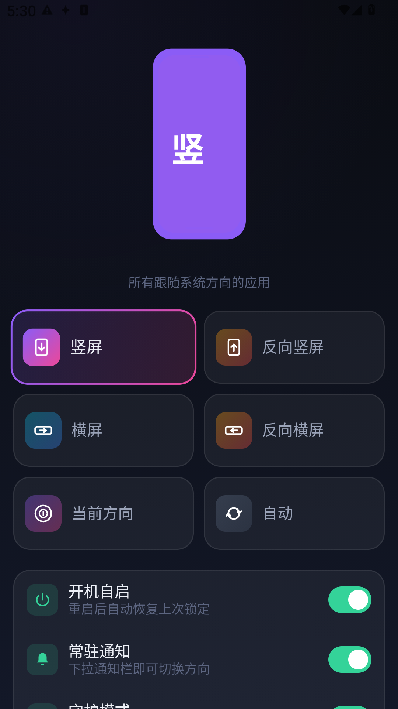
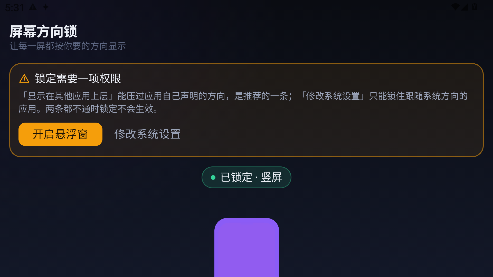

# 屏幕方向锁

> 免 root 的安卓全局屏幕方向锁定工具。**能锁住那些「自己声明了方向」的应用**——车机桌面、部分音视频应用、游戏。

[](LICENSE)
[](https://developer.android.com)
[](app/build.gradle.kts)

<p align="center">
  
  &nbsp;&nbsp;
  
</p>

---

## 它和别的方向锁有什么不同

市面上多数免 root 方向锁只会写 `Settings.System` 里的方向值，**对「自己声明了方向」的应用完全无效**——因为安卓的优先级是：

```
应用自己声明的方向  >  全局系统设置
```

车机桌面（如氢桌面，声明 `sensorLandscape`）、部分视频/音乐应用、部分游戏，都属于这一类，它们会把屏幕掰回去，你锁不住。

**本项目的做法是加一个 0×0 的悬浮窗，在窗口参数上声明方向。** 悬浮窗在窗口层级上高于普通应用窗口，窗口管理器计算屏幕方向时会把它的请求算进去，于是应用自己的声明被压过去。

只需要「显示在其他应用上层」这一个普通权限，**不需要 root，也不需要 Shizuku**。

### 实测验证

在声明了 `sensorLandscape` 的车机桌面前台：

| 操作 | 屏幕 |
|---|---|
| 锁定竖屏 | `1920x1080` → **`1080x1920`** |
| 保持 20 秒 | **稳在竖屏，一秒没动** |
| 杀掉本应用撤下悬浮窗 | 该桌面**立刻抢回横屏** |

最后一步是对照实验——它排除了「碰巧」的可能，证明确实是悬浮窗在压着。

---

## 功能

- **6 种方向模式**：竖屏、反向竖屏、横屏、反向横屏、当前方向、自动（跟随传感器）
- **常驻通知栏**：竖屏 / 横屏 / 解除 / 反向 四个按钮，不打开应用即可切换
- **开机自启**：重启后自动恢复上次锁定
- **守护模式**：方向被别的途径改掉时自动改回来
- **全中文深色界面**：方向渐变配色、可旋转的手机示意图

---

## 安装

1. 到 [Releases](../../releases) 下载 `app-release.apk`
2. 安装后打开，顶部会出现琥珀色权限引导卡
3. **点「开启悬浮窗」**，在系统设置页打开开关
4. 返回后即可使用

### 两条权限通路

| 权限 | 能力 | 建议 |
|---|---|---|
| **显示在其他应用上层** | 用悬浮窗强制屏幕方向，**能锁住声明了方向的应用** | **推荐**，有它就够了 |
| 修改系统设置 | 写系统方向设置，只能锁住「跟随系统方向」的应用 | 可选的补充 |

**有一条能用就能锁。** 只给「修改系统设置」时，车机桌面那类应用锁不住。

---

## 已知限制

**锁不住系统自己固定的方向**——例如某些车机的开机画面、部分 ROM 固定的锁屏。那不在应用层能触及的范围，安卓没有给应用任何入口。

另外，悬浮窗需要应用进程存活。本应用用前台服务持有它，并做了开机自启与守护；如果被系统或国产 ROM 的后台管理杀掉，锁定会随之失效。若遇到这种情况，请在系统的「自启动管理」里允许本应用自启，并关闭对它的后台限制——应用内「系统适配」卡片提供跳转按钮。

---

## 构建

### 环境

- JDK 21（推荐直接用 Android Studio 自带 JBR）
- Android SDK，`compileSdk 36`
- Gradle 8.12（wrapper 已随仓库提交）

```bash
git clone <repo>
cd screen-orientation-lock
./gradlew assembleDebug
```

产物：`app/build/outputs/apk/debug/app-debug.apk`

### 一个容易踩的坑

`gradle.properties` 里写死了

```properties
org.gradle.java.home=C:/Program Files/Android/Android Studio/jbr
```

因为原开发机的默认 JDK 是 Java 26，与 AGP 8.9.3 不兼容，不指定就会报 `Unsupported class file major version`。**在别的机器上请把这一行改成本机 JDK 21 的路径**，或删掉它并设好 `JAVA_HOME`。

注意 Gradle 只从 `gradle.properties` 或 `JAVA_HOME` 读这个属性，写在 `local.properties` 里无效。

### 跑测试

```bash
./gradlew testDebugUnitTest
```

88 个单元测试，全部跑在 JVM 上，不需要模拟器，也不需要 Robolectric。

### 打正式包

仓库不含签名密钥。要打签名包，在仓库根目录建 `keystore.properties`（已在 `.gitignore` 中）：

```properties
storeFile=keystore/release.jks
storePassword=你的口令
keyAlias=你的别名
keyPassword=你的口令
```

没有这个文件时 release 包会退化为未签名，**构建不会失败**——开源项目应当「clone 即可构建」。

---

## 代码结构

```
app/src/main/java/com/orientlock/
├── OrientLockApp.kt        Application：建通知渠道、带兜底的服务启动
├── MainActivity.kt         单 Activity
├── domain/                 纯 Kotlin，零安卓依赖，可 JVM 单测
│   ├── NaturalOrientation.kt    天然朝向 + 纯函数判定（含 DisplayRotation）
│   ├── OrientationMode.kt       6 种模式 × 中文标签 / 持久化名 / 系统值映射
│   ├── OrientationGuard.kt      守护偏离判定
│   ├── AppSettings.kt           设置数据模型
│   └── OrientationRepository.kt 数据访问接口（依赖倒置，便于测试）
├── data/
│   ├── SystemOrientationAccess.kt  平台读写（唯一接触 Settings.System 之处）
│   ├── SystemOrientationWriter.kt  方向写入策略（探测互斥、双采样、先校验再写）
│   ├── SettingsOrientationRepository.kt  DataStore + 守护心跳
│   └── Preferences.kt               DataStore 委托
├── system/
│   ├── OverlayOrientationController.kt  ★ 悬浮窗方向接管（能压过应用声明的关键）
│   ├── OverlayOrientation.kt            模式 → 悬浮窗方向值映射
│   ├── OrientationService.kt            前台服务：通知 + 守护 + 持有悬浮窗
│   ├── BootReceiver.kt                  开机 / 应用更新后拉起
│   ├── NotificationHelper.kt            通知渠道与通知构建
│   ├── PermissionChecker.kt             权限查询接口 + 安卓实现
│   ├── PermissionIntents.kt             系统设置页跳转
│   └── ServiceGateway.kt                启停服务的接口 + 安卓实现
└── ui/
    ├── theme/                  配色 / 字形 / 主题 / 模式渐变（唯一来源）
    ├── MainViewModel.kt        UI 状态与用户意图
    ├── MainScreen.kt           主界面
    ├── AppRoot.kt              ViewModel 与主题的接线
    └── components/             PhonePreview / ModeCard / StatusPill / …
```

**分层原则**：`domain` 层不 import 任何 `android.*`，所以单元测试全部跑在 JVM 上；`Settings.System` 的读写被限制在 `SystemOrientationAccess` 一个类里，是全应用风险最集中处，也因此有专门测试。

---

## 兼容性

- 最低支持 Android 8.0（API 26）
- `targetSdk` 定为 35 而非 36：Android 16（API 36）起，系统会**无视平板与折叠屏上应用声明写死的方向**。定 35 可让本软件在大屏设备上继续生效。

---

## 许可

[MIT](LICENSE)
